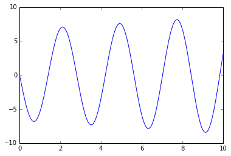

Let's integrate the following system of differential equations

$$\frac{dx}{dt} = v$$

$$\frac{dv}{dt} = 5(10-x)$$

starting from the initial condition $(x_0,v_0)=(13,0)$.


```python
# We'll build up tables of t,x,v values by stepping forward in time.  
# First, initialize the tables to empty lists.

t_table = []
x_table = []
v_table = []

# The variables t,x,v will keep track of the current values of time,position,velocity 
# as we evolve the equations.  First we initialize them to starting values which are 
# determined by the initial conditions of the differential equation.

t = 0.0
x = 13.0
v = 0.0

# Now let's evolve the differential equations forward in time, to t=10 (say).
#
# We use a step size dt=0.01.  Choosing a proper step size can be tricky and sometimes
# requires trial-and-error experimentation.  If the step size is chosen too large, then
# the differential equations will be integrated inaccurately and the solution will look
# "jagged".  If the step size is chosen too small, then many steps will be needed and
# the calculation will take a long time (or crash the computer).
#
# In the following 'while' loop, the value of t will be increased by dt=0.01 in every
# iteration, and the loop exits when the value of t reaches 10.

while t <= 10.0:
    # Append the current values of t,x,v to the tables
    t_table.append(t)
    x_table.append(x)
    v_table.append(v)
    
    # Compute dx/dt and dv/dt from the differential equations
    dx_dt = v
    dv_dt = 5.*(10.-x)
    
    # Now update the values of t,x,v and 
    dt = 0.01             # step size
    t = t + dt            # t advances by "dt"
    x = x + dx_dt * dt    # x advances by its rate (dx/dt) times "dt"
    v = v + dv_dt * dt    # likewise for v
    

```


```python
# The little program above makes
# Let's print a few entries in the table, just to check that it worked!
# Printing 
print t_table[0]
print x_table[0]
print v_table[0]
```

    0.0
    13.0
    0.0


```python
print t_table[100]
print x_table[100]
print v_table[100]
```

    1.0
    8.10221595712
    -5.41282614081


```python
# These commands only need to be included once per notebook.
%matplotlib inline
import matplotlib.pyplot as plt
```

    /opt/conda/envs/python2/lib/python2.7/site-packages/matplotlib/font_manager.py:273: UserWarning: Matplotlib is building the font cache using fc-list. This may take a moment.
      warnings.warn('Matplotlib is building the font cache using fc-list. This may take a moment.')


```python
# Plot x versus t.
# Note that the amplitude of the oscillation appears to be increasing in the plot.
# This is incorrect since the true solution to the differential equation is a sinusoid.
# This is actually just an artifact of the numerical integration, and one could see this
# by rerunning with a smaller step size dt.

plt.plot(t_table, x_table)
```


    [<matplotlib.lines.Line2D at 0x7f8ba11a13d0>]


```python
# Plot v versus t.

plt.plot(t_table, v_table)
```


    [<matplotlib.lines.Line2D at 0x7f8ba0ffb910>]





```python

```
